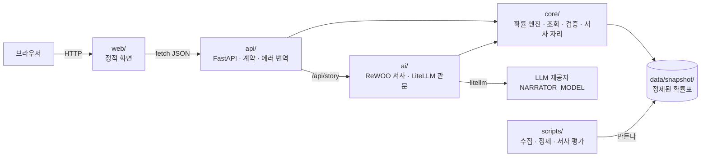
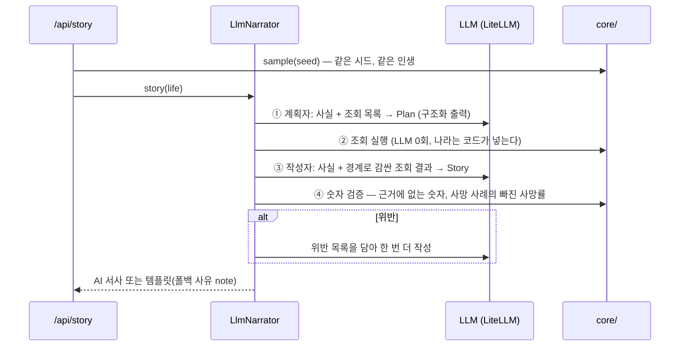

# 아키텍처

## 층 그림



## 층별 책임

| 층 | 한다 | 안 한다 |
|---|---|---|
| `web/` | 입력 받기, 결과 그리기, 진행·에러 표시 | 확률 계산, 데이터 해석 |
| `api/` | 요청 검증(Pydantic), 코어 호출, 에러를 HTTP 상태로 번역 | 확률 계산, 통계 보관 |
| `core/` | 조건부 확률 체인, 뽑기, 역확률, 목표 달성 횟수, 맥락 조회, 숫자 검증, 서사 자리 | HTTP, 모델 호출 |
| `ai/` | LLM 호출(구조화 출력·재시도·폴백·비용 장부·예산), ReWOO 서사 | 숫자 계산 — 조회와 검증은 `core/`를 부른다 |
| `prompts/` | 계획자·작성자 프롬프트 원문 | 코드에 프롬프트를 박지 않는다(고친 것이 diff로 보이게) |
| `data/snapshot/` | 정제된 확률표와 출처·연도 기록 | 원본(raw)은 두지 않는다 |
| `scripts/` | 원본 수집, 정제, 리포트 | 서비스 실행 중에는 돌지 않는다 |

## 경계 세 개

1. **숫자는 `core/`만 낸다.** 화면도, API도, LLM도 확률을 계산하지 않는다.
   모든 숫자의 출처는 `data/snapshot/`의 표와 `core/`의 순수 함수다.
2. **`core/`는 문도 모델도 모른다.** `core/`는 FastAPI도 LiteLLM도 import하지 않는다. import 방향은
   `api → ai → core`, `api → core` 뿐이다.
3. **모델은 판단만 하고, 판정은 코드가 한다.** 어떤 조회를 할지, 어떤 문장으로 쓸지는 모델이 정하고,
   어느 나라를 조회할지와 서사의 숫자가 맞는지는 코드가 정한다.

## AI가 들어갈 자리

**자리는 하나: 뽑힌 사실로 그 사람의 이야기를 쓴다.**

```python
# core/narrator.py
class Narrator(Protocol):
    name: str
    def narrate(self, life: Life) -> Narrative: ...
```

| 구현 | 언제 | 무엇을 하나 |
|---|---|---|
| `ScriptedNarrator` (`core/narrator_scripted.py`) | v0.2~, 키가 없거나 LLM이 실패할 때 | 사실 목록을 정해진 문장에 끼워 넣는다. 화면에 "템플릿 서사"로 표시 |
| `LlmNarrator` (`ai/narrator_llm.py`) | v0.5~, `/api/story` | ReWOO로 맥락을 조회해 이야기를 쓰고, 코드가 숫자를 검증한다 |

- 서사가 기댈 수 있는 사실은 `core/facts.py`의 `facts_of(life)`와 `core/context.py`의 조회 결과가 전부다.
- 뽑기(`/api/simulate`)는 언제나 템플릿 서사로 즉시 돌려준다. AI 서사는 화면의 버튼으로 `/api/story`를 부를 때만 쓴다
  (비용과 지연은 원할 때만).
- AI가 없어도(키 없음·한도·예산·장애) 뽑기·역확률·템플릿 서사는 전부 동작한다.

## AI 서사의 흐름 (ReWOO)



| 실패 | 처리 |
|---|---|
| 스키마에 안 맞는 출력 | 오류를 보여 주고 같은 모델에 한 번 더 |
| 근거에 없는 숫자 / 사망률 누락 | 위반을 알려 한 번 더 쓰게 하고, 그래도면 템플릿 |
| 429 요청 한도 | LiteLLM 재시도 후 템플릿 + "잠시 후 다시" 안내 |
| 제공자 장애 | `NARRATOR_FALLBACKS` 폴백 모델 → 그래도면 템플릿 |
| 누적 비용이 `STORY_BUDGET_USD` 도달 | 더 부르지 않고 템플릿 |
