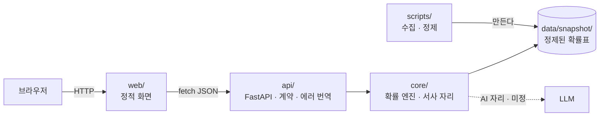

# 아키텍처

## 층 그림

## 층별 책임

| 층 | 한다 | 안 한다 |
|---|---|---|
| `web/` | 입력 받기, 결과 그리기, 진행·에러 표시 | 확률 계산, 데이터 해석 |
| `api/` | 요청 검증(Pydantic), 코어 호출, 에러를 HTTP 상태로 번역 | 확률 계산, 통계 보관 |
| `core/` | 조건부 확률 체인, 뽑기, 역확률, 목표 달성 횟수, 서사 자리 | HTTP, 파일 경로 하드코딩, 모델 SDK 직접 호출 |
| `data/snapshot/` | 정제된 확률표와 출처·연도 기록 | 원본(raw)은 두지 않는다 |
| `scripts/` | 원본 수집, 정제, 리포트 | 서비스 실행 중에는 돌지 않는다 |

## 경계 두 개

1. **숫자는 `core/`만 낸다.** 화면도, API도, 나중에 붙을 LLM도 확률을 계산하지 않는다.
   모든 숫자의 출처는 `data/snapshot/`의 표와 `core/`의 순수 함수 하나다.
2. **`core/`는 문을 모른다.** `core/`는 FastAPI를 import하지 않는다. 그래서 HTTP 외에 MCP 같은
   문을 더 달아도 `core/`는 고치지 않는다.

## AI가 들어갈 자리

**미정.** 후보는 "뽑힌 사실로 그 사람의 삶 이야기를 쓰는 자리" 하나다. 어떤 시그니처로 둘지는
v0.2에서 각본 대역과 함께 정한다. AI가 없어도 뽑기·역확률은 전부 동작해야 한다.
