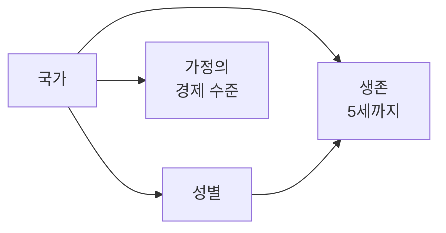

# 확률 모델

## 왜 조건부 체인인가

속성을 서로 독립으로 뽑으면 "5세 미만 사망률이 10%인 나라에서 태어나 하루 $8.30 이상을 쓰는
가정"과 "그 반대"가 같은 확률로 섞인다. 현실에서는 앞의 결과가 뒤의 분포를 바꾼다. 그래서
속성을 **앞 결과에 조건부인 사슬**로 뽑는다.



## 노드별 정의

### 1. 국가 `country`

```
P(국가 = c) = 출생아 수(c) / Σ 출생아 수
출생아 수(c) ≈ 조출생률(c, ‰) × 총인구(c) / 1000
```

- 출처: World Bank `SP.DYN.CBRT.IN`, `SP.POP.TOTL` — 국가마다 가장 최근의 비어 있지 않은 값.
- 가정: 조출생률 연도와 인구 연도가 다를 수 있다(차이는 정제 리포트에 남긴다).
- 둘 중 하나라도 없는 국가는 뽑기에서 빠지고, 사유와 함께 `reports/`에 남는다.

### 2. 성별 `sex` | 국가

```
P(남 | c) = r / (1 + r),  r = 출생 성비(남아 수 / 여아 수)
```

- 출처: World Bank `SP.POP.BRTH.MF`.
- 없으면 1.05를 쓰고 **가정했다고 표시**한다.

### 3. 생존 `survival` | 국가, 성별

세 갈래로 나눈다.

| 값 | 확률 |
|---|---|
| `infant_death` (1세 전 사망) | IMR(c, s) / 1000 |
| `child_death` (1~4세 사망) | (U5MR(c, s) − IMR(c, s)) / 1000 |
| `survived_5` (5세까지 생존) | 1 − U5MR(c, s) / 1000 |

- 출처: World Bank / UN IGME `SP.DYN.IMRT.MA.IN`, `SP.DYN.IMRT.FE.IN`, `SH.DYN.MORT.MA`, `SH.DYN.MORT.FE` (출생아 1,000명당).
- 성별 값이 없으면 전체 값을 쓰고 가정했다고 표시한다. 그것도 없으면 이 노드는 **데이터 없음**이다.

### 4. 가정의 경제 수준 `economy` | 국가

1인당 하루 소비(2021 PPP) 구간으로 나눈다. 빈곤율은 누적 비율이라 차이가 곧 구간 확률이다.

| 값 | 확률 |
|---|---|
| `below_3_00` (하루 $3.00 미만, 극빈) | p₃.₀₀ |
| `below_4_20` ($3.00~$4.20) | p₄.₂₀ − p₃.₀₀ |
| `below_8_30` ($4.20~$8.30) | p₈.₃₀ − p₄.₂₀ |
| `above_8_30` ($8.30 이상) | 1 − p₈.₃₀ |

- 출처: World Bank PIP `SI.POV.DDAY`, `SI.POV.LMIC`, `SI.POV.UMIC` (% of population).
- 가정: **전체 인구의 빈곤율을 신생아에게 그대로 적용한다.** 실제로는 아동의 빈곤율이 전체보다
  높은 나라가 많아서, 이 값은 신생아의 빈곤을 **낮게** 잡는 쪽으로 틀린다.
- 세 값 중 하나라도 없으면 이 노드는 **데이터 없음**이다(0으로 채우지 않는다).

### 맥락 정보 (뽑지 않는다)

- 기대수명(국가·성별): World Bank `SP.DYN.LE00.MA.IN`, `SP.DYN.LE00.FE.IN`. 개인의 수명을 뽑으려면
  생명표가 필요하므로, 여기서는 "이 나라 같은 성별의 기대수명"으로만 보여 준다.

## 데이터 없음을 다루는 법

- 뽑기: 노드 값이 `None`(데이터 없음)으로 나오고, 화면은 "통계 없음"이라고 말한다.
- 역확률: 대상 조건에 그 노드가 들어가면 **통계가 있는 국가만으로** 계산하고, 그 국가들이 출생아에서
  차지하는 비율(`coverage`)을 함께 돌려준다. "이 확률은 출생아의 87%를 대상으로 계산했습니다".

## 엔진이 하는 일

| 함수 | 하는 일 |
|---|---|
| `sample(seed, country=None)` | 시드 고정 뽑기. 같은 시드면 같은 인생. 국가를 고정할 수 있다 |
| `probability(target)` | 조건의 정확한 확률. 범주가 작아 전부 열거해 더한다 |
| `tries_needed(p, q)` | 확률 q로 한 번 이상 나오려면 몇 번 다시 태어나야 하나: ⌈ln(1−q) / ln(1−p)⌉ |
| `sample_until(target, max_tries)` | 실제로 조건이 나올 때까지 뽑는다. 상한이 있다 |

## 검증

- 10만 번 뽑은 빈도가 위 정의의 확률과 통계적으로 맞는지 테스트로 지킨다.
- `probability`가 모든 결과에 대해 더하면 1인지, 몬테카를로 결과와 맞는지 테스트한다.
